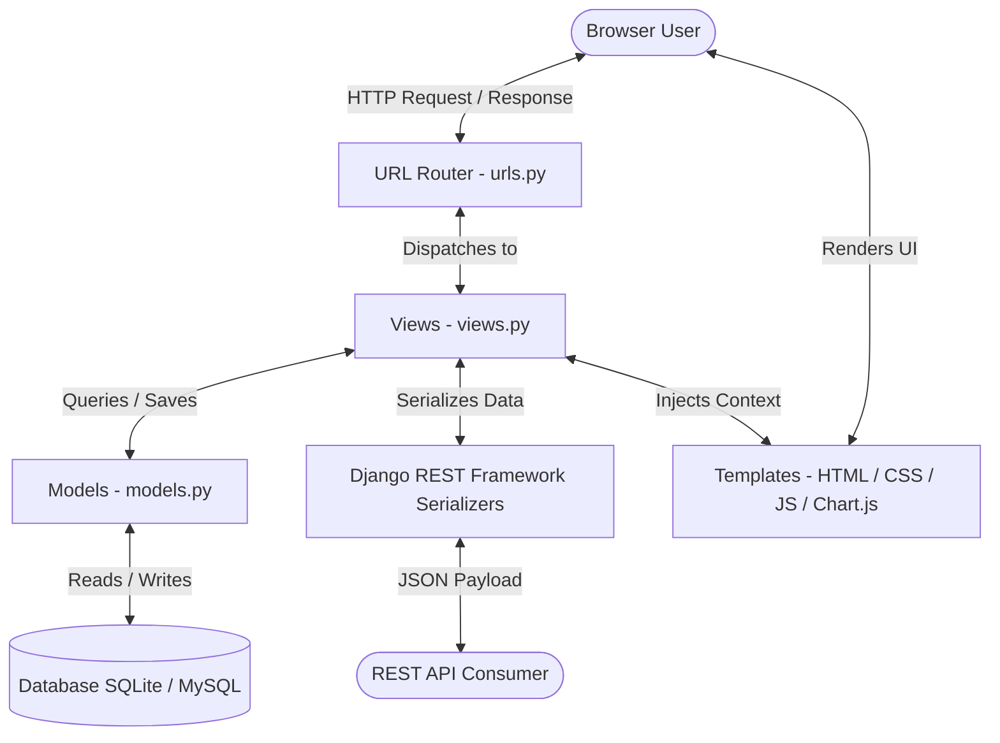

# Personal Finance & Investment Tracker

A production-quality web application built using **Django**, **Django REST Framework (DRF)**, **SQLite/MySQL**, **Bootstrap 5**, and **Chart.js**. This project is designed for IT Engineering college submissions, demonstrating advanced concepts in Python Programming, Database Normalization, Django MVT Architecture, Secure Authentication, REST APIs, File Handling (CSV), and Data Visualization.

---

## 1. PROJECT ABSTRACT

Managing personal finances is a key element of modern economic life, but users face friction in aggregating daily expenses, monthly budgeting, long-term Mutual Fund SIPs, equity stock portfolios, and future savings targets. The **Personal Finance & Investment Tracker** addresses this by providing a unified web application. 

The application enables daily expense logging, automatically triggers budget alerts when thresholds are crossed, calculates Systematic Investment Plan (SIP) profit/loss values, estimates stock portfolios based on dynamic market inputs, and visualizes progress on savings goals (e.g., Laptop, Emergency Fund). Built using Django's Model-View-Template (MVT) architecture, the project includes secure authentication, file importing/exporting (CSV), high-fidelity PDF report generation, and fully authenticated REST APIs.

---

## 2. SYSTEM ARCHITECTURE & MVC/MVT PATTERN

The application follows Django's standard **Model-View-Template (MVT)** pattern, which is a variation of the classic Model-View-Controller (MVC) architecture:



- **Model**: Represents the database structures. We define schemas for `UserProfile`, `Expense`, `SIPInvestment`, `StockInvestment`, and `SavingsGoal`.
- **View**: Acts as the controller, handling request-response cycles, business logic, calculations, file handling (CSV import/export, PDF drawing), and data parsing.
- **Template**: The user interface rendered using HTML5, CSS3, Bootstrap 5, and JavaScript. Data visualization is executed on the client-side using Chart.js.

---

## 3. DATABASE DESIGN & SCHEMA

The database is normalized to **3rd Normal Form (3NF)**. All tables are user-scoped, carrying a foreign key pointing to Django's built-in `auth_user` table with cascading deletions.

### ER Diagram Relationship Structure
- Each `User` has **one** corresponding `UserProfile` (1:1 Relationship).
- Each `User` can create **zero or many** `Expense` records (1:N Relationship).
- Each `User` can create **zero or many** `SIPInvestment` records (1:N Relationship).
- Each `User` can create **zero or many** `StockInvestment` records (1:N Relationship).
- Each `User` can create **zero or many** `SavingsGoal` records (1:N Relationship).

### Database Tables Schema

#### 1. `accounts_userprofile` (1:1 with auth_user)
| Column Name | Data Type | Constraints | Description |
| :--- | :--- | :--- | :--- |
| `id` | BigInt | Primary Key, Auto-increment | Row identifier |
| `user_id` | Int | Unique, ForeignKey(auth_user) | Link to User account |
| `currency` | VarChar(3) | Choices: USD, EUR, INR, GBP... | Preferred currency code |
| `profile_pic` | VarChar(100) | Nullable | Path to profile image upload |
| `monthly_budget_limit` | Decimal(10, 2) | Default: 0.00 | Budget warning threshold |

#### 2. `expenses_expense` (1:N with auth_user)
| Column Name | Data Type | Constraints | Description |
| :--- | :--- | :--- | :--- |
| `id` | BigInt | Primary Key, Auto-increment | Row identifier |
| `user_id` | Int | ForeignKey(auth_user) | Owner of the expense |
| `name` | VarChar(100) | Not Null | Expense name (e.g. Groceries) |
| `category` | VarChar(20) | Choices: Food, Bills, etc. | Group category |
| `amount` | Decimal(10, 2) | Not Null | Cost value |
| `date` | Date | Not Null | Date of transaction |
| `notes` | Text | Nullable | Optional text details |

#### 3. `investments_sipinvestment` (1:N with auth_user)
| Column Name | Data Type | Constraints | Description |
| :--- | :--- | :--- | :--- |
| `id` | BigInt | Primary Key, Auto-increment | Row identifier |
| `user_id` | Int | ForeignKey(auth_user) | Owner of the SIP |
| `fund_name` | VarChar(150) | Not Null | Mutual Fund Name |
| `monthly_amount` | Decimal(10, 2) | Not Null | Monthly savings outlay |
| `start_date` | Date | Not Null | Start Date |
| `invested_amount` | Decimal(12, 2) | Not Null | Total cumulative capital invested |
| `current_value` | Decimal(12, 2) | Not Null | Current market valuation |

#### 4. `investments_stockinvestment` (1:N with auth_user)
| Column Name | Data Type | Constraints | Description |
| :--- | :--- | :--- | :--- |
| `id` | BigInt | Primary Key, Auto-increment | Row identifier |
| `user_id` | Int | ForeignKey(auth_user) | Owner of the equity asset |
| `stock_name` | VarChar(150) | Not Null | Stock Company Name |
| `symbol` | VarChar(10) | Not Null | Stock Ticker (e.g. AAPL) |
| `quantity` | Int (unsigned) | Not Null | Number of shares held |
| `buy_price` | Decimal(10, 2) | Not Null | Purchase price per share |
| `current_price` | Decimal(10, 2) | Not Null | Current market price per share |

#### 5. `goals_savingsgoal` (1:N with auth_user)
| Column Name | Data Type | Constraints | Description |
| :--- | :--- | :--- | :--- |
| `id` | BigInt | Primary Key, Auto-increment | Row identifier |
| `user_id` | Int | ForeignKey(auth_user) | Owner of the target |
| `name` | VarChar(100) | Not Null | Goal target (e.g. New Laptop) |
| `target_amount` | Decimal(12, 2) | Not Null | Target saving sum |
| `current_savings` | Decimal(12, 2) | Default: 0.00 | Capital accumulated so far |
| `target_date` | Date | Not Null | Expected achievement date |

---

## 4. REST API DOCUMENTATION

The REST API module is implemented via **Django REST Framework (DRF)**. All endpoints reside under the `/api/` prefix and require session authentication. Users are restricted to querying and modifying only their own records.

### Endpoints List

- `GET /api/expenses/` - List all expenses of the authenticated user
- `POST /api/expenses/` - Create a new expense (automatically assigns `user`)
- `PUT /api/expenses/<id>/` - Update an expense
- `DELETE /api/expenses/<id>/` - Delete an expense
- `GET /api/sips/` - List all SIP investments
- `POST /api/sips/` - Create a SIP
- `PUT /api/sips/<id>/` - Update a SIP
- `DELETE /api/sips/<id>/` - Delete a SIP
- `GET /api/stocks/` - List all stock holdings
- `POST /api/stocks/` - Create a stock holding
- `PUT /api/stocks/<id>/` - Update a stock holding
- `DELETE /api/stocks/<id>/` - Delete a stock holding
- `GET /api/goals/` - List all savings goals
- `POST /api/goals/` - Create a savings goal
- `PUT /api/goals/<id>/` - Update a savings goal
- `DELETE /api/goals/<id>/` - Delete a savings goal

### Sample API Request & Response

#### Request: `POST /api/expenses/`
**Headers**:
- `Content-Type: application/json`
- `X-CSRFToken: <token>`

**Body**:
```json
{
  "name": "Supermarket Groceries",
  "category": "Food",
  "amount": "84.50",
  "date": "2026-06-11",
  "notes": "Weekly snacks and items"
}
```

#### Response: `201 Created`
**Body**:
```json
{
  "id": 12,
  "name": "Supermarket Groceries",
  "category": "Food",
  "amount": "84.50",
  "date": "2026-06-11",
  "notes": "Weekly snacks and items"
}
```

---

## 5. SYSTEM SECURITY IMPLEMENTATION

1. **Authentication Protection**: Views are protected using Django's `@login_required` decorators or class-based `LoginRequiredMixin`.
2. **Access Isolation**: Every database query is scoped to the request user (e.g. `Expense.objects.filter(user=request.user)`), preventing any authenticated user from tampering with or viewing another user's financial datasets.
3. **Cross-Site Request Forgery (CSRF)**: All POST requests, including templates and AJAX integrations, require a valid `` verification.
4. **Password Security**: Managed by Django's robust authentication backend, which implements PBKDF2 with a SHA256 hash by default.
5. **Form Validation**: Clean validation methods handle anomalies (e.g. checking matching passwords during registration, verifying file formats for CSV uploads, preventing negative amounts).

---

## 6. INSTALLATION & SETUP GUIDE

Follow these steps to run the application locally.

### Prerequisites
- Python 3.8 or above installed on your system.
- Pip (Python Package Installer).

### Steps

1. **Clone/Open Workspace**:
   Navigate to the project root directory:
   ```bash
   cd "c:\Users\LENOVO\Documents\Finance Tracker"
   ```

2. **Initialize Virtual Environment**:
   ```bash
   python -m venv venv
   ```
   Activate it:
   - On Windows (PowerShell):
     ```powershell
     .\venv\Scripts\Activate.ps1
     ```
   - On Mac/Linux:
     ```bash
     source venv/bin/activate
     ```

3. **Install Dependencies**:
   ```bash
   pip install -r requirements.txt
   ```

4. **Execute Database Migrations**:
   Create initial migration scripts:
   ```bash
   python manage.py makemigrations
   ```
   Apply them to create database tables:
   ```bash
   python manage.py migrate
   ```

5. **Create an Admin Superuser**:
   ```bash
   python manage.py createsuperuser
   ```
   *(Follow the prompts to enter username, email, and password)*

6. **Start the Development Server**:
   ```bash
   python manage.py runserver
   ```
   Access the application in your browser at: [http://127.0.0.1:8000/](http://127.0.0.1:8000/)

---

## 7. SYSTEM TESTS

To verify calculations, authentication gates, and API constraints, execute the test suite:
```bash
python manage.py test
```

---

## 8. ENGINEERING VIVA QUESTIONS & ANSWERS

### Q1: What is the benefit of Django's MVT architecture over classic MVC?
**A**: In Django's MVT, the framework itself acts as the "Controller" (handling request routing and middleware), which saves developers from writing custom controller logic. The "Template" takes the responsibility of rendering views dynamically, while the "View" focuses on business logic, database queries, and context mapping, simplifying development.

### Q2: Why did you extend the User model with a UserProfile model instead of custom subclassing AbstractUser?
**A**: We used a `OneToOneField` mapping to extend the User model via a `UserProfile` model. This is the recommended modular approach for simple extensions (adding preferences, profile pictures, limits) without complicating database schema modifications. Subclassing `AbstractUser` must be configured *before* the first database migration is run, which is less flexible if database tables are already initialized.

### Q3: How does the application prevent User A from viewing or deleting User B's financial data?
**A**: Every view and REST API endpoint filters querysets by the request user context (e.g., `sips = SIPInvestment.objects.filter(user=request.user)`). For creating items, `perform_create` or form handlers enforce ownership by explicitly assigning `obj.user = request.user` instead of exposing the user ID parameter in forms or inputs.

### Q4: Explain how the budget alert system works in your code.
**A**: During expense creation or editing, a check is triggered in `views.py`. It sums the user's spending in the current month and compares it against `user.profile.monthly_budget_limit`. If the spending exceeds the limit (and the limit is greater than 0), a Django `messages.warning` alert is registered, displaying immediately in the template as a Bootstrap alert banner.

### Q5: How do the Stock and SIP profit/loss calculations differ in your models?
**A**:
- For **SIPs**: Profit/loss is calculated on cumulative inputs: `current_value - invested_amount`. Percentage return is `(profit_loss / invested_amount) * 100`.
- For **Stocks**: We track per-share prices and quantity. Invested value is `quantity * buy_price`, current value is `quantity * current_price`. Profit/loss is `current_value - invested_value`, percentage return is `((current_price - buy_price) / buy_price) * 100`.

### Q6: How does the CSV import handle invalid dates or amounts?
**A**: The CSV import processes data line-by-line within a `try-except` block. If parsing an amount fails, or if the date does not match YYYY-MM-DD or MM/DD/YYYY formats, the row is safely skipped or defaults are applied. This guarantees that a single corrupted line does not crash the entire file upload.

### Q7: Why did you use Django REST Framework (DRF) instead of default Django views for APIs?
**A**: DRF provides built-in Serializers that automate validation and convert complex database querysets to and from JSON payloads. It also includes built-in permission classes (`IsAuthenticated`), authentication mechanisms (session, token), routers, and an interactive browsable web API interface.

### Q8: What library did you use for PDF generation, and why?
**A**: We utilized **ReportLab**, Python's standard PDF engine. We used `SimpleDocTemplate` along with Flowables (`Paragraph`, `Spacer`, `Table`, `TableStyle`) to compile data directly into a memory buffer (`BytesIO`) and return a `FileResponse` to the browser, eliminating the need to write temporary files to the disk.

### Q9: How is the Light/Dark mode theme persisted across page reloads?
**A**: The theme is managed on the client side using CSS variables and JavaScript. When the user clicks the theme toggle button, the theme mode (`light` or `dark`) is written to `localStorage`. A blocking script in the `<head>` of `base.html` reads `localStorage` before rendering, avoiding page flash.

### Q10: How do you handle file uploads, such as user profile pictures?
**A**: Profile pictures are handled via Django's `ImageField` in the `UserProfile` model. They require the `Pillow` library for format validation. When a profile picture is uploaded, Django stores it in the folder designated by `MEDIA_ROOT` and serves it via the path mapped to `MEDIA_URL`.

### Q11: What is the role of Django signals in your accounts app?
**A**: We set up `post_save` signals on the Django `User` model. Whenever a new `User` is created (e.g. via registration), the receiver function `create_user_profile` runs automatically to create an associated `UserProfile` record, keeping database tables synchronized.

### Q12: Why is CSRF protection important, and how does Django implement it?
**A**: CSRF (Cross-Site Request Forgery) attacks force an authenticated user's browser to submit malicious requests. Django prevents this by generating a unique token (stored in a cookie and validated on forms). For every POST/PUT/DELETE request, Django checks that the token submitted with the headers matches the session token.

### Q13: How would you switch this application from SQLite to MySQL in production?
**A**: In `settings.py`, we modify the `DATABASES` setting. Change `'ENGINE'` to `'django.db.backends.mysql'`, and provide the `'NAME'`, `'USER'`, `'PASSWORD'`, `'HOST'`, and `'PORT'` parameters. In addition, install the `mysqlclient` database adapter via pip.

### Q14: How does Chart.js get its data from the Django views?
**A**: The dashboard view computes metrics and converts them into a serialized JSON string using Python's `json.dumps()`. This string is injected into the HTML page inside a hidden `<script type="application/json">` container. On page load, `dashboard.js` reads and parses this container to initialize charts.

### Q15: What are serializer fields like `read_only_fields` used for in DRF?
**A**: Fields designated as `read_only` (like `id`, `profit_loss`, or `progress_pct`) are included in API response payloads, but are ignored during write operations (POST, PUT). This prevents clients from tempering with computed parameters or ID primary keys.

---

## 9. CONCLUSION & FUTURE SCOPE

The Personal Finance & Investment Tracker successfully implements a secure, normalized, and visually compelling financial dashboard. 

### Future Enhancements:
- **Live Market API Integration**: Fetch real-time stock prices and mutual fund NAVs using APIs like AlphaVantage or Yahoo Finance.
- **AI-Driven Budgeting**: Implement machine learning models to classify expenses and predict cash flows or budget overflows.
- **Tax Optimization**: Add modules to calculate tax deductions based on tax regimes and mutual fund holdings (ELSS).
- **Automated Bank Alerts Integration**: Allow scanning email receipts or SMS notifications to auto-add expenses.
